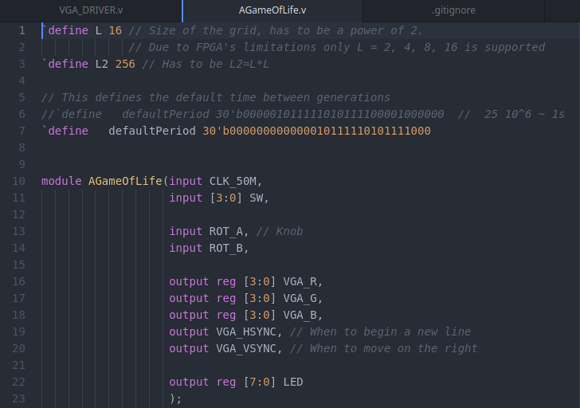

 

  <h3 align="center">Laboratory of Advanced Electronics - code</h3>

  

    Code for the course "Laboratory of Advanced Electronics" held by prof. Leonardo Ricci (ay. 2021-2022)
     
     
    <a href="https://github.com/NerusSkyhigh/LoAE-code/tree/main/Project%20-%20Game%20of%20Life">A Game of Life</a>
    ·
    <a href="https://nerusskyhigh.github.io/LoAE-notes/README.html">Notes</a>
    ·
    <a href="https://www.linkedin.com/in/guglielmo-grillo/">LinkedIn</a>
  

## Lab Class 1 - 8
These folders contain the code developed in the laboratory classes during the courses. Each folder contains:
- A pdf with the assignment given;
- The Verilog, Xise, and ucf files developed;
- A .bit compiled version of the files;
- Miscellaneous file for the specific assignment.

<!-- ABOUT THE PROJECT -->
## About The Project

One part of the final examination was the development of a project on the FPGA provided. The folder "Project - Game of Life" contains all the files related. If you are interested in the project a place to start is the file "GRILLO_G_A_Game_of_Life_LoAE_Project.pdf" which contains an overview of the project.
